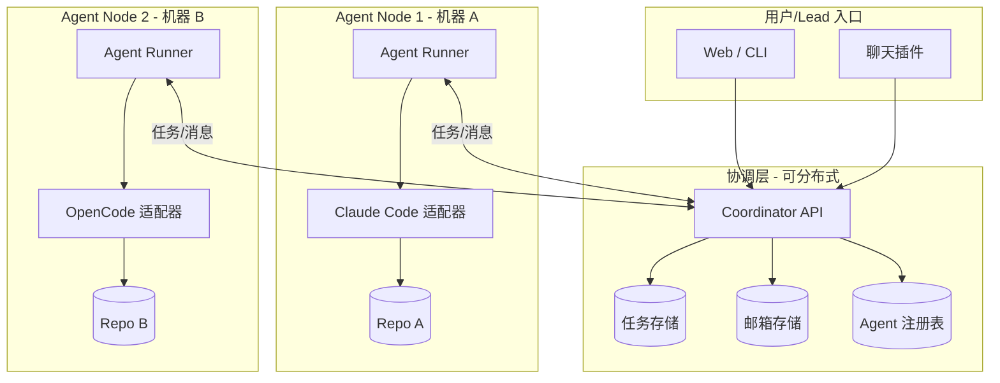

# 分布式 Agent Mesh 设计与实现计划

## 一、目标与范围

**核心差异**（相对 Claude Code Agent Teams）：


| 维度       | Claude Code Agent Teams | Agent Mesh（目标）                                 |
| -------- | ----------------------- | ---------------------------------------------- |
| 工作目录     | 单一共享代码库                 | 每 agent 独立代码库                                  |
| Agent 类型 | 仅 Claude Code           | 多 CLI 可插拔（Claude Code、OpenCode、Gemini、Codex 等） |
| 部署       | 单机（共享文件系统）              | 分布式（多机器/容器）                                    |
| 配置       | 由 lead 统一决定             | 由各 repo 负责人配置其 agent 的 CLI                     |


**成功标准**：用户能创建 mesh，指定多个 repo 及各自 agent 配置，各 agent 在各自 repo 上工作，通过任务列表和消息协同完成共同目标。

---

## 二、整体架构




**核心组件**：

1. **Coordinator**：中心协调服务，提供任务列表、邮箱、agent 注册的 API，支持多实例（后续可扩展为分布式）
2. **Agent Node**：类似 Docker 镜像，预配置好后可动态扩容；每个需求可分配一组 agent mesh，另一需求可启动另一组，按需启停
3. **Adapter**：每个 CLI 一个适配器，负责「如何把任务/消息交给该 CLI」和「如何感知完成/输出」

### 2.1 用户/Lead 入口（分期实现）


| 阶段     | 入口方式          | 说明                                                                     |
| ------ | ------------- | ---------------------------------------------------------------------- |
| **一期** | Web 控制台 + CLI | 用户通过 Web 或 CLI 创建 mesh、查看任务、发送指令；CLI 可以是大众熟知 CLI 的改版或附加配置              |
| **后期** | 聊天软件插件        | 插件支持各类聊天软件（如群聊），用户可：查看 agent 讨论与进展、直接干预、@ 特定 agent 或广播给所有 agent（如澄清需求） |


### 2.2 Agent Node 的弹性模型

- **预配置**：Agent Node 镜像/配置由人工一次性配置（repo、CLI 类型、环境变量等）
- **按需扩容**：一个需求 → 启动一组 agent mesh；另一需求 → 启动另一组，互不干扰
- **动态启停**：需求完成后 mesh 可回收，资源释放

---

## 三、CLI 集成机制（回答「各 CLI 如何协同」）

不同 CLI 能力不同，采用**适配器 + 多策略**：


| CLI 类型     | 集成策略                          | 示例                                                 |
| ---------- | ----------------------------- | -------------------------------------------------- |
| 有 HTTP API | 直接调用 API 创建 session、发送 prompt | OpenCode `serve` + SDK                             |
| 文件系统驱动     | 写入约定路径，由本地进程同步到 CLI 期望位置      | Claude Code：同步到 `~/.claude/teams/.../inboxes/`     |
| 支持非交互/管道   | 通过 stdin 注入 prompt，解析 stdout  | `opencode run "task"`、部分 CLI 的 `--non-interactive` |
| 仅交互式       | 人工辅助模式：控制台展示任务/消息，人工在终端执行     | 兜底方案                                               |


**实现优先级**：

- **P0**：OpenCode 适配器（有 `opencode serve` + SDK，最易自动化）
- **P1**：Claude Code 适配器（需 Agent Node 与 Claude Code 同机，或通过共享/同步文件）
- **P2**：通用 stdin 驱动适配器（适用于支持 `cmd "prompt"` 的 CLI）
- **P3**：人工辅助模式（无适配器时仍可参与 mesh）

---

## 四、数据模型与协议

### 4.1 任务（参考 Claude Code，扩展 repo 归属）

```json
{
  "id": "uuid",
  "meshId": "mesh-001",
  "subject": "实现用户认证模块",
  "description": "...",
  "status": "pending|in_progress|completed|deleted",
  "owner": "agent-frontend",
  "repoId": "repo-frontend",
  "blocks": ["task-2"],
  "blockedBy": ["task-1"],
  "createdAt": "...",
  "updatedAt": "..."
}
```

**约束**：创建/更新任务时需校验 `blocks`/`blockedBy` 不形成循环依赖（DAG 校验）。

### 4.2 消息（跨 agent 通信）

```json
{
  "id": "uuid",
  "from": "agent-backend",
  "to": "agent-frontend",
  "type": "task_assignment|message|broadcast|...",
  "payload": { ... },
  "timestamp": "...",
  "read": false
}
```

### 4.3 Agent 注册（含 CLI 配置）

```json
{
  "id": "agent-frontend",
  "name": "前端 Agent",
  "repoId": "repo-frontend",
  "cliType": "opencode",
  "cliConfig": {
    "serverUrl": "http://localhost:4096",
    "model": "claude-sonnet"
  },
  "nodeId": "node-1",
  "status": "idle|busy|offline"
}
```

### 4.4 Repo 配置

```json
{
  "id": "repo-frontend",
  "path": "/path/to/repo",
  "gitRemote": "https://github.com/org/frontend.git",
  "agentId": "agent-frontend"
}
```

**约束**：当前设计为**每 repo 单 Agent**（`agentId` 与 `repoId` 1:1）。未来若支持多 Agent 共享同一 repo，需补充并发与冲突策略。

### 4.5 Mesh 生命周期

```json
{
  "id": "mesh-001",
  "status": "created|running|completed|recycled",
  "createdAt": "...",
  "completedAt": "..."
}
```

- **created**：mesh 已创建，agent 尚未全部就绪
- **running**：mesh 运行中，agent 在工作
- **completed**：任务完成，资源可回收
- **recycled**：mesh 已回收，资源释放

---

## 五、技术选型


| 组件              | 建议技术                           | 说明          |
| --------------- | ------------------------------ | ----------- |
| Coordinator API | Node.js (Fastify) 或 Go (Fiber) | 轻量、易扩展      |
| 任务/邮箱/注册表存储     | SQLite（MVP）→ PostgreSQL（分布式）   | 单文件起步，便于迁移  |
| Agent Node      | 同语言或 Rust                      | 需长期运行、资源占用小 |
| 实时推送            | WebSocket 或 SSE                | 减少轮询        |
| 配置格式            | YAML/JSON                      | 人类可读，便于版本管理 |


---

## 六、分布式部署考量

- **Coordinator**：可多实例 + 共享数据库，或使用 Redis 作为任务/消息队列
- **Agent Node**：每台机器运行一个 node 进程，通过 `nodeId` 注册，只拉取分配给自己的 agent 的任务
- **网络**：Coordinator 暴露 HTTP/WebSocket；Node 主动连接，支持内网/跨机房
- **安全**：API 认证（API Key / JWT）、TLS、最小权限访问 repo

---

## 七、实现阶段

### Phase 1：协调层 MVP（2-3 周）

- Coordinator API：任务 CRUD、邮箱收发、agent 注册
- SQLite 存储
- 基础 CLI：创建 mesh、添加 repo、创建任务

### Phase 2：首个适配器 + Agent Node（2 周）

- Agent Node 框架：轮询任务、拉取邮箱、调用适配器
- OpenCode 适配器：通过 `opencode serve` API 创建 session、发送 prompt
- 单机验证：1 Coordinator + 1 Node，2 个 repo，2 个 OpenCode agent

### Phase 3：多适配器 + 人工模式（2 周）

- Claude Code 适配器（同机或文件同步）
- 通用 stdin 适配器（支持 `cli "prompt"` 的 CLI）
- 人工辅助模式：Web 控制台展示任务/消息，人工在终端执行

### Phase 4：分布式与可观测性（2 周）

- Coordinator 多实例 + Redis/PostgreSQL
- Agent Node 弹性扩容（按需求动态启停 mesh 组）
- 跨机器 Agent Node 部署
- 日志、指标、简单 Web UI（任务看板、消息流）

### Phase 5：聊天软件插件（后期）

- 插件框架：统一消息出口（任务进展、agent 讨论）与入口（用户干预、@agent、广播）
- 首批插件：支持 1–2 款主流聊天软件（如 Slack、飞书、Discord 等）

---

## 八、项目结构（建议）

```
agent-mesh/
├── packages/
│   ├── coordinator/      # 协调 API 服务
│   ├── node/             # Agent Node 运行时
│   ├── adapters/         # 各 CLI 适配器
│   │   ├── opencode/
│   │   ├── claude-code/
│   │   └── stdin/
│   └── shared/           # 协议、类型、工具
├── apps/
│   ├── cli/              # 用户 CLI（可基于现有 CLI 改版或附加配置）
│   ├── web/              # Web 控制台
│   └── plugins/          # 聊天软件插件（后期）
│       └── slack/        # 示例：Slack 插件
├── docs/
│   └── plans/
└── config/
    └── mesh.example.yaml
```

---

## 九、设计文档


| 文档                 | 路径                                                                                                         | 状态  |
| ------------------ | ---------------------------------------------------------------------------------------------------------- | --- |
| Coordinator API 设计 | [docs/plans/2025-03-16-001-coordinator-api-design.md](docs/plans/2025-03-16-001-coordinator-api-design.md) | 已创建 |
| Adapter 协议规范       | [docs/plans/2025-03-16-002-adapter-protocol.md](docs/plans/2025-03-16-002-adapter-protocol.md)             | 已创建 |
| 分布式部署方案            | [docs/plans/2025-03-16-003-distributed-deployment.md](docs/plans/2025-03-16-003-distributed-deployment.md) | 已创建 |
| 配置示例               | [config/mesh.example.yaml](config/mesh.example.yaml)                                                       | 已创建 |


---

## 十、风险与缓解


| 风险                   | 缓解                           |
| -------------------- | ---------------------------- |
| 部分 CLI 无 API/非交互模式   | 提供人工辅助模式，仍可参与 mesh           |
| Claude Code 依赖本地文件   | 同机部署 Node，或通过 NFS/同步脚本桥接     |
| 分布式下任务一致性            | 使用数据库事务 + 乐观锁，或引入消息队列        |
| Token 成本随 agent 数量增长 | 在文档和 UI 中明确成本提示，支持按需启停 agent |


---

## 十一、专家评审意见（2025-03 整理）

### 11.1 优点

- 目标与差异清晰，成功标准可验证
- 架构分层合理，Mermaid 图与文字一致
- CLI 集成策略务实，P0–P3 优先级可落地
- 数据模型可扩展，阶段划分合理
- 风险有初步考虑，技术选型符合 MVP 需求

### 11.2 待补充设计点（按优先级）


| 优先级           | 问题                                               | 对应文档                            | 状态  |
| ------------- | ------------------------------------------------ | ------------------------------- | --- |
| **Critical**  | Adapter 与 Runner 的接口契约（入参/出参/超时、完成回传、失败处理）       | adapter-protocol.md             | 已完善 |
| **Critical**  | 任务分配与 Agent 归属逻辑（新任务分配、多 Agent 竞争、Lead 指定归属）     | coordinator-api-design.md       | 已完善 |
| **Critical**  | 分布式下 Coordinator 多实例一致性（存储分工、会话亲和性、WebSocket 路由） | distributed-deployment.md       | 已完善 |
| **Important** | 错误与恢复策略（Agent 崩溃、网络中断、任务失败、死信处理）                 | coordinator-api-design.md       | 已完善 |
| **Important** | 同一 Repo 多 Agent 的冲突处理（当前设计：每 repo 单 Agent）       | 本文档 + coordinator-api-design.md | 已完善 |
| **Important** | 任务依赖循环检测（blocks/blockedBy 的 DAG 校验）              | coordinator-api-design.md       | 已完善 |
| **Important** | Agent Node 与 Coordinator 的认证机制（Node 注册、权限隔离）     | coordinator-api-design.md       | 已完善 |
| **Minor**     | 消息持久化与归档策略                                       | coordinator-api-design.md       | 已完善 |
| **Minor**     | CLI 版本兼容策略                                       | adapter-protocol.md             | 已完善 |
| **Minor**     | mesh.example.yaml 示例配置                           | config/                         | 已完善 |


### 11.3 建议行动

进入 Phase 1 实现前，优先完成：

1. **Adapter 协议文档**（至少包含 Runner–Adapter 接口）
2. **Coordinator API 设计**（任务分配规则、错误处理策略、DAG 校验、认证模型）
3. **分布式部署方案**（存储分工、多实例路由、一致性策略）

---

## 下一步

1. ~~完善上述三份设计文档~~（已完成）
2. 确认后进入 **Phase 1 实现计划**，写入 `docs/plans/2025-03-16-agent-mesh-phase1.md`

